# Codeworks Azure 🌩️ cloud function for file uploading

## A little about the technology
While it's simple to add a url for an image to any model of data, that's not typically how web-apps work, if you're curious that we knew that we did, but file upload itself isn't the quickest thing to implement and can add a lot of dev time to our applications. We need a file storage somewhere else then our document or table databases, we need to configure access to it so our client can upload to it, and typically some way to compress the data the user is trying to upload so we can minimize our costs.

Instead of going through this process for each and every app we build, it's much easier to create a serverless chunk of code that can handle the upload for us that can be used from any of our apps.

### Cloud functions
Why cloud functions

### Blob Storage
What is blob storage?


## 🔧 Setup and preparation

You will need to complete these before you can begin.

### Azure Cloud Account
⚠️`While there are many free things you can do with Azure, and Azure offers credits for new accounts, this will not be free. Depending on your use case though It can be very very cheap (My personal use costs me less than $1 a month)`

You will need to [create and Azure Cloud Account](https://azure.microsoft.com/en-us/free/). If you want to sign up using github that is recommended. You will also need to make sure you have a [payment method set up](https://learn.microsoft.com/en-us/azure/cost-management-billing/manage/change-credit-card).

### Create an Azure Subscription 
[🔗Azure Docs](https://learn.microsoft.com/en-us/azure/cost-management-billing/manage/create-subscription#create-a-subscription)
Azure subscriptions are how you track usage costs, while just having one subscription is nice and keeps things simple you may want to consider multiple subscriptions per client.

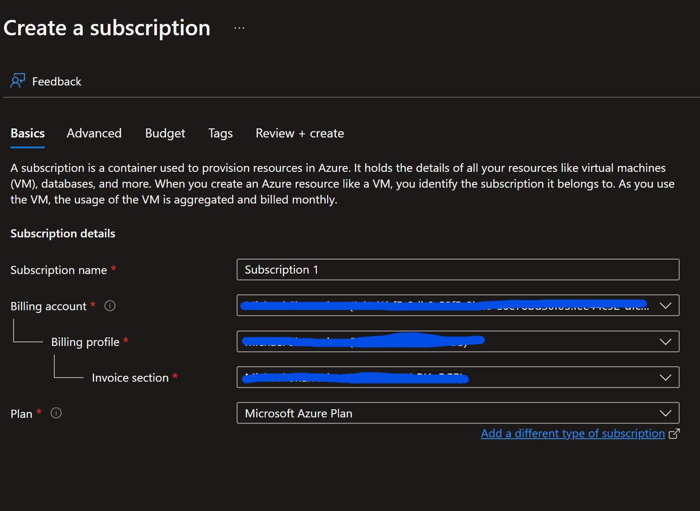
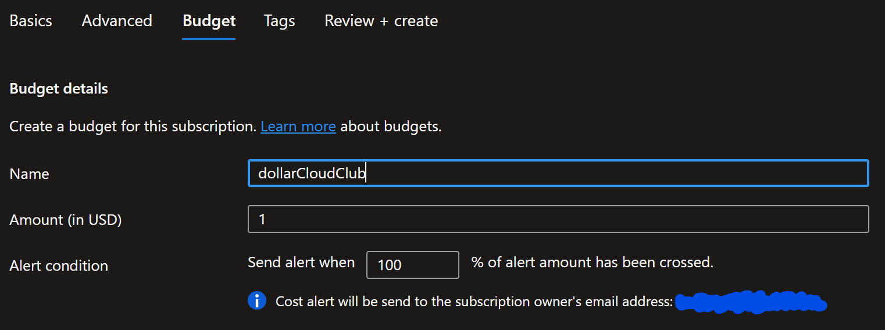

### Create an Azure Storage Account

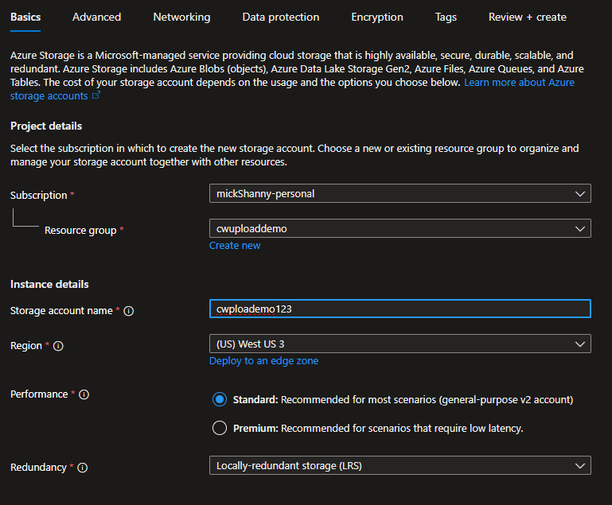
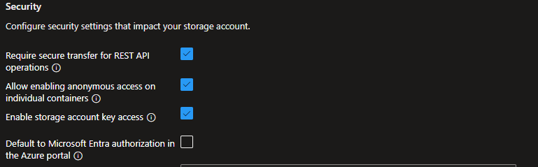


### Create a Container in your storage Account

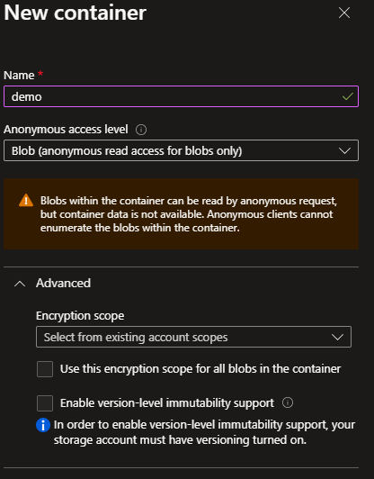

### Download the Azure Tools Extension

  Download and Log into the Azure tools extension

  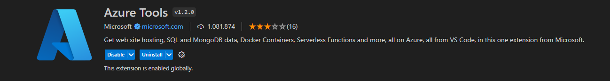


## 💻 The Code
 
### Create an Empty folder 
open this folder in vs code

### Create Function from Azure tools template

`ctrl+shift+p` => Azure Create Function => HTTP trigger => name it (image-upload) => this will create all the necessary files for the function to work.

### Setup the local.settings.json

You will want to add your auth0 keys to the `values` section of json file and fill them out. the `AzureWebJobsStorage` also needs to be filled in. You can get this connection string from the Azure extension by right clicking on the storage account.

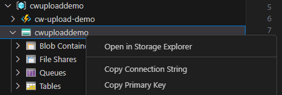

```json
"AUTH0_DOMAIN": "",
"AUTH0_AUDIENCE": "",
"AUTH0_CLIENT_ID": ""
```

### Spin up and test

You can either us `f5` or the debug menu to start a local instance of your function, you should get a success message telling you the address you can reach the function from 

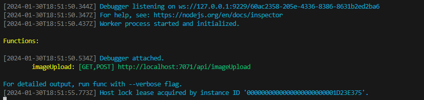

If you head over to postman, you should be able to send a `POST` or `GET` Request to the endpoint listed in your console and get a response back!

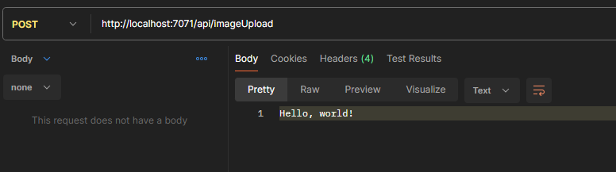

You have your first cloud function!

One last thing we are going to do before we move on is update the code here to use, modules, that way use import statements like we are used too instead of require statements like in the template.
  - Rename your function so that it ends with a `.mjs`
  - Update the package.json to include `.mjs`

  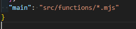

  - update our code to `import` app instead of require

  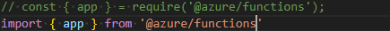

  - 🗝️ *make sure to stop and start this function and test it again in postman.*


### Almost ready to upload

Before we move onto uploading we want to install some node modules to this function.
Jump into your console and import the following packages

  - `@azure/storage-blob` lets us create and upload "blobs" to our storage account
  -  `@bcwdev/auth0provider` Allows us to implement user authentication
  -  `parse-multipart` Offers a quick solution to pulling the file data from our request
  -  `sharp` Not necessary, but offers a great amount of tools for image processing 


### 🔒 Authorizing Requests

We want to make sure that people making requests to this endpoint are authorized. This ensures that they have logged into one of our applications first. For now we just want to spin up any of our applications and get a token from them for postman to use. We first will want to build out a try catch so any thrown errors are returned to the user. 

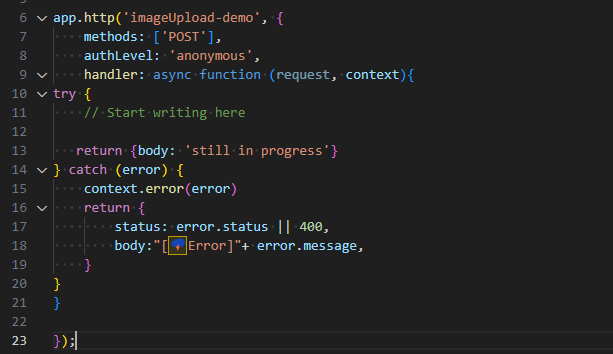

Jump into the example code to the `⚓AUTHORIZE` anchor, and build out what you see.


Make sure to stop and test this. You can use a `context` to log the userInfo into your console and check if the userInfo is being pulled out.

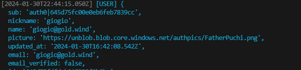

### 📡 Uploading Files

Lets Upload a file to our function using postman. Set the method to `POST`, and in the body options for the request, select form-data. For the key select `file`. This gives us a drop down and lets us select a file from our computer to send.

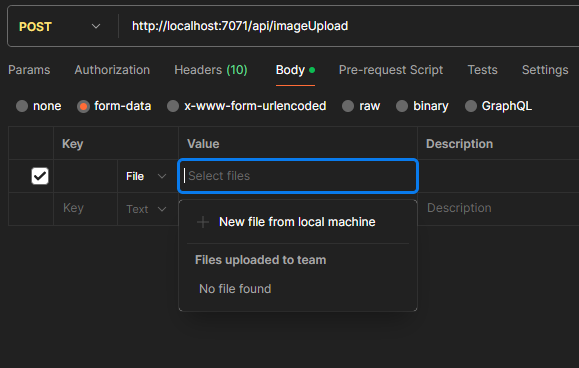


We will be using this picture of an orangutan... for no reason in particular.


Like before jump to the `⚓GET FILE`, and build along with the comments. You should be able to stop and once again context log the details of the file you chose to upload.

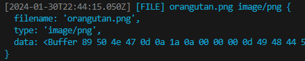

### ☁️ Save to Blob

Now that we have the file in our function, lets connect to our blob storage container, and save the file to it. Go to the `⚓SAVE IMAGE` and follow along.

This time to test we are going to head back into the Azure Portal, where we created our container earlier, and see if the file was uploaded. If you're not sure how to get there try
> storage accounts => `your storage` => containers => `your container` where you should see a folder labeled with the `id` of the user logged in, and the image inside


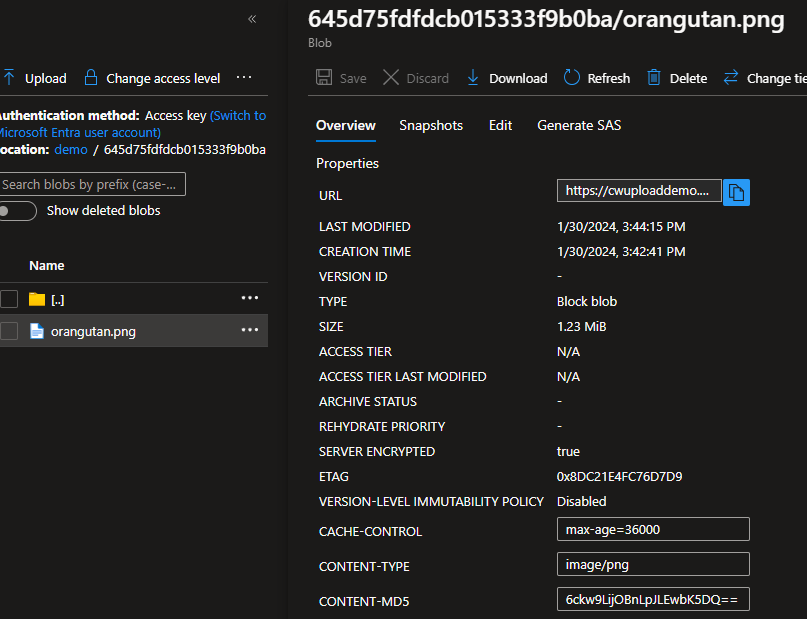

click the blue `copy` button to copy the url, and drop it into the url of a new tab. You should see an the image you uploaded appear.

> ⚠️ A common error will be "resource not found" error. This occurs when permissions to the storage OR container are not set for anonyms reading.

Here are where those settings are for both.

Container; should be set to `blob`
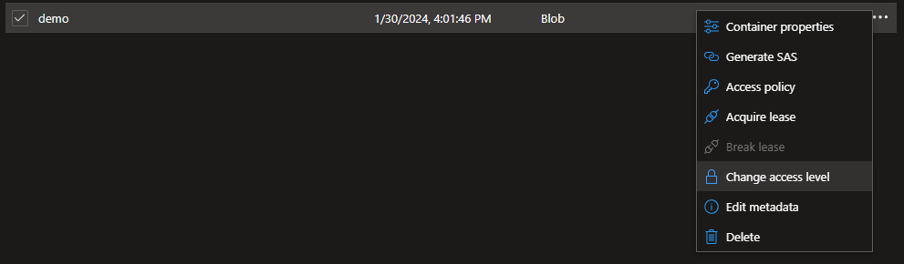

Account; Allow blob anonymous access Enabled
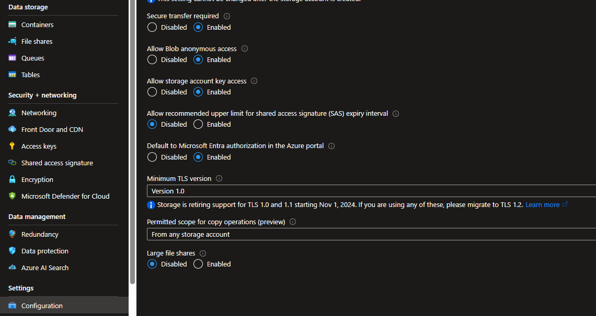

### 🛰️ Respond!

The last step is to respond with the relevant information. In this case we give them back the url to access the image for any of their needs, the size in kb and the file name. They will need to save this file name if they want to delete this file later.

## 📦 Deploy

